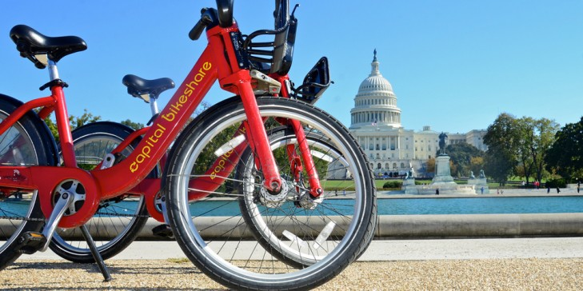

<!-- Main -->

<!-- One -->
<section id="two" class="spotlights">

	<section>
			
		

			

				<header class="major">
					<h3>Analysis</h3>
				</header>
				<b><u>The average distance travelled is estimated to be <i>3.6923</i> miles</u></b>
				  
				<h4> Assumptions/Criteria </h4>
				
 1. Assume the average miles per second for each user is roughly the same (hence, find this by dividing sum of distances in One way trips by sum of duration)

				 2. Hence, since d = rt, multiply this miles per second average by the total time spent in all trips to get the total distance

				 3. Divide the total distance by the total number of trips to get the average distance travelled per trip.

			

		

	</section>
</section>

<!-- Two -->
<section id="three">
	

		<header class="major">
			<h2>SQL Query Used</h2>
		</header>

		SELECT SUM(Duration) * (SELECT SUM(dist)/SUM(Duration) AS MilesperSecond FROM
		(SELECT distanceInMiles(CAST(StartingLatitude AS FLOAT), CAST(StartingLongitude AS FLOAT),
		CAST(EndingLatitude AS FLOAT), CAST(EndingLongitude AS FLOAT)) AS dist, Duration FROM BikeShare WHERE TripRouteCategory != 'Round Trip') AS allDistances1) / COUNT(*) FROM
		(SELECT distanceInMiles(CAST(StartingLatitude AS FLOAT), CAST(StartingLongitude AS FLOAT),
		CAST(EndingLatitude AS FLOAT), CAST(EndingLongitude AS FLOAT)) AS dist2, Duration FROM BikeShare) AS sumAll;

	

</section>

