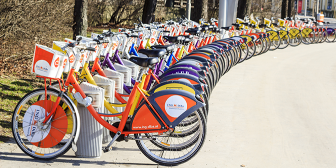

<!-- Main -->

<!-- One -->
<section id="two" class="spotlights">
	<section>
		

			

				<header class="major">
					<h3>Graphs and Data Visualization</h3>
				</header>
					<iframe width="600" height="371" seamless frameborder="0" scrolling="no" src="https://docs.google.com/spreadsheets/d/e/2PACX-1vSDkHpvMe6_URtnaDE1rfvSKauAQcQgESzbr7ernzcGIYiuz_fZAl-odFaRAI2dq172609pAhdRL7Pc/pubchart?oid=271665241&amp;format=interactive"></iframe>				
					 
					
 Nullam et orci eu lorem consequat tincidunt vivamus et sagittis magna sed nunc rhoncus condimentum sem. In efficitur ligula tate urna. Maecenas massa sed magna lacinia magna pellentesque lorem ipsum dolor. Nullam et orci eu lorem consequat tincidunt. Vivamus et sagittis tempus. 

					<iframe width="600" height="371" seamless frameborder="0" scrolling="no" src="https://docs.google.com/spreadsheets/d/e/2PACX-1vSDkHpvMe6_URtnaDE1rfvSKauAQcQgESzbr7ernzcGIYiuz_fZAl-odFaRAI2dq172609pAhdRL7Pc/pubchart?oid=29820259&amp;format=interactive"></iframe>
					 
					
 Nullam et orci eu lorem consequat tincidunt vivamus et sagittis magna sed nunc rhoncus condimentum sem. In efficitur ligula tate urna. Maecenas massa sed magna lacinia magna pellentesque lorem ipsum dolor. Nullam et orci eu lorem consequat tincidunt. Vivamus et sagittis tempus. 

			

		

	</section>
	<section>
			
		

			

				<header class="major">
					<h3>Analysis</h3>
				</header>
				
Nullam et orci eu lorem consequat tincidunt vivamus et sagittis magna sed nunc rhoncus condimentum sem. In efficitur ligula tate urna. Maecenas massa sed magna lacinia magna pellentesque lorem ipsum dolor. Nullam et orci eu lorem consequat tincidunt. Vivamus et sagittis tempus.

			

		

	</section>
</section>

<!-- Two -->
<section id="three">
	

		<header class="major">
			<h2>SQL Queries Used</h2>
		</header>

		SELECT CASE WHEN EXTRACT(MONTH FROM StartTime) >= 12 OR EXTRACT(MONTH FROM StartTime) <= 2 THEN 'Winter' WHEN EXTRACT(MONTH FROM StartTime) >= 3 AND EXTRACT(MONTH FROM StartTime) <= 5 THEN 'Spring' WHEN EXTRACT(MONTH FROM StartTime) >= 6 AND EXTRACT(MONTH FROM StartTime) <= 8 THEN 'Summer' ELSE 'Autumn' END Season, PassholderType, COUNT(*) AS NumberOfRides FROM BikeShare GROUP BY Season, PassholderType ORDER BY COUNT(*)  DESC, Season DESC;

		 
		 

		SELECT CASE WHEN EXTRACT(MONTH FROM StartTime) >= 12 OR EXTRACT(MONTH FROM StartTime) <= 2 THEN 'Winter' WHEN EXTRACT(MONTH FROM StartTime) >= 3 AND EXTRACT(MONTH FROM StartTime) <= 5 THEN 'Spring' WHEN EXTRACT(MONTH FROM StartTime) >= 6 AND EXTRACT(MONTH FROM StartTime) <= 8 THEN 'Summer' ELSE 'Autumn' END Season,
		 CASE WHEN Duration >= 0 AND Duration < 120 THEN 'Between 0 and 120 seconds'
		 WHEN Duration >= 120 AND Duration < 300 THEN 'Between 120 and 300 seconds'
		 WHEN Duration >= 300 AND Duration < 900 THEN 'Between 300 and 900 seconds'
		 ELSE 'Over 900 seconds' END DurationBucket, COUNT(*) AS NumberOfRides FROM BikeShare
		 GROUP BY Season, DurationBucket ORDER BY COUNT(*) DESC, Season DESC;
	

</section>

